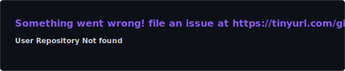

<!-- ══════════════════════ AURORA HEADER ══════════════════════ -->
<div align="center">
  
</div>

<!-- ══════════════════════ TYPING ANIMATION ══════════════════════ -->
<div align="center">
  <a href="https://github.com/bilalnaveed-dev">
    
  </a>
</div>

<br/>

<!-- ══════════════════════ SOCIAL BADGES ══════════════════════ -->
<div align="center">
  <a href="https://www.linkedin.com/in/bilal-naveed-">
    
  </a>
  <a href="https://github.com/bilalnaveed-dev/Portfolio">
    
  </a>
  <a href="mailto:bilalnaveed4520@gmail.com">
    
  </a>
  
</div>


<!-- ══════════════════════ ABOUT ME ══════════════════════ -->
##  About Me

```javascript
const bilal = {
    location: "Lahore, Pakistan 🇵🇰",
    education: "BS Computer Science @ UET Lahore (2023–2027) — CGPA 3.4",
    role: "Full Stack (MERN) Developer & AI/ML Enthusiast",
    experience: "2+ years building production web apps & AI-integrated systems",
    stack: {
        frontend:  ["React.js", "Next.js", "React Native", "Tailwind CSS"],
        backend:   ["Node.js", "Express.js", "Django", "RESTful APIs"],
        databases: ["MongoDB", "PostgreSQL", "SQLite"],
        aiMl:      ["OpenAI API", "Google Gemini", "OpenCV", "MediaPipe", "Prompt Engineering"],
    },
    shipped: "10+ projects — SaaS ERPs, POS systems, LMS platforms, conversational AI",
    funFact: "I taught my mouse cursor to follow my eyes 👀",
};
```

- 💼 Ex **Software Development Intern @ Softsincs** — shipped React frontends & REST APIs for a live production MERN app
- 🤖 Deep into **conversational AI & computer vision** — Gemini, OpenAI, OpenCV, MediaPipe
- 🏗️ I build **multi-tenant SaaS platforms** end to end: architecture, APIs, RBAC, UI
- 📫 Reach me on [LinkedIn](https://www.linkedin.com/in/bilal-naveed-) or [email](mailto:bilalnaveed4520@gmail.com)


<!-- ══════════════════════ TECH ARSENAL ══════════════════════ -->
##  Tech Arsenal

<div align="center">

### Frontend & Mobile


### Backend, APIs & Databases


### AI/ML & Tools


</div>


<!-- ══════════════════════ GITHUB STATS ══════════════════════ -->
##  GitHub Analytics

<div align="center">
  
  
</div>

<div align="center">
  
</div>

<br/>

<div align="center">
  
</div>

<br/>

<div align="center">
  
</div>


<!-- ══════════════════════ SIGNATURE PROJECTS ══════════════════════ -->
##  Signature Projects

| Project | What it does | Tech |
|---------|--------------|------|
| 🍽️ **Restaurant Management SaaS** | Full-scale restaurant operations platform with **74 modules** — POS, inventory, kitchen workflows, and complete **cash-in / cash-out** financial tracking covering every rupee that moves through the restaurant | MERN, Tailwind CSS |
| 🏙️ **Smart City** | Multi-tenant **real estate ERP SaaS** — 10+ business modules, finance & interactive plot mapping, RBAC for landlords/agents/tenants/admins, automated workflows cutting manual data entry by **70–80%** | React, Node.js, Express, MongoDB |
| 🎓 **KidsHub** | Gamified **LMS** for school-age students — interactive games, quizzes, visual progress tracking, and role-based dashboards for Student, Teacher, Parent & Admin | MERN, Flutter (mobile) |
| 🤖 **AI-Powered Chatbot** | Full-stack **conversational AI** on Google Gemini — context-aware real-time responses, OTP email auth with JWT, persistent cross-session chat history | MERN, Gemini API, Vite |
| 👁️ **Eye-Controlled Mouse** | **Hands-free cursor control** mapping real-time gaze to the mouse — blink-based clicks (single, double, extended), smooth low-latency tracking | Python, OpenCV, MediaPipe |
| 🕷️ **Web Crawler** | Automated **lead generation** — headless-browser crawler extracting structured contact & business data, cutting manual research by hours per campaign | Node.js, Puppeteer, Cheerio |
| 📋 **Smart Quest System** | Role-based **academic request tracking** with automated faculty approval hierarchy and auto-escalation on response-time breaches | Django, SQLite |

> 💡 Most of my flagship work lives in **private / client repositories** — the cards below are a sample of my public code.

### 📂 On GitHub

<div align="center">
  <a href="https://github.com/bilalnaveed-dev/Portfolio">
    
  </a>
  <a href="https://github.com/bilalnaveed-dev/Resume-Screening">
    
  </a>
  <br/>
  <a href="https://github.com/bilalnaveed-dev/Media-Player-System">
    
  </a>
  <a href="https://github.com/bilalnaveed-dev/Ice-Cream-Project">
    
  </a>
  <br/>
  <a href="https://github.com/bilalnaveed-dev/Chatbot">
    
  </a>
  <a href="https://github.com/bilalnaveed-dev/Coin-Collector-Assembly-Language">
    
  </a>
</div>


<!-- ══════════════════════ SNAKE ANIMATION ══════════════════════ -->
##  Contribution Snake

<div align="center">
  
</div>


<!-- ══════════════════════ LET'S CONNECT ══════════════════════ -->
##  Let's Build Something Together

<div align="center">

**🚀 Actively seeking AI/ML & Software Engineering opportunities** — internships, freelance, and collaborations

<br/>

<a href="https://www.linkedin.com/in/bilal-naveed-">
  
</a>
<a href="mailto:bilalnaveed4520@gmail.com">
  
</a>
<a href="https://github.com/bilalnaveed-dev?tab=followers">
  
</a>

<br/><br/>

<sub>⚡ <i>"First, solve the problem. Then, write the code."</i> — John Johnson</sub>

</div>

<!-- ══════════════════════ FOOTER ══════════════════════ -->
<div align="center">
  
</div>
